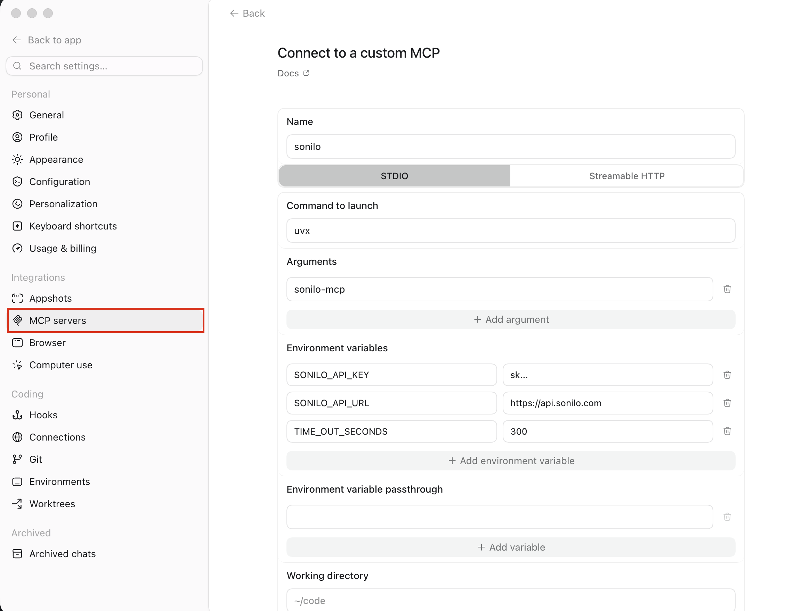

# Sonilo MCP Server

An MCP (Model Context Protocol) server that exposes [Sonilo](https://platform.sonilo.com)'s AI music generation API to MCP-compatible clients (Claude Desktop, Codex).

## Why Sonilo

- **Video-to-music** — give it a video and Sonilo composes a full-length score matched to its pacing, motion, and emotion. Transitions and beat drops align to your cut points, and the track matches the video's duration exactly — no prompts or manual syncing required.
- **Text-to-music** — generate tracks from a text description (genre, mood, tempo, instrumentation) at an exact duration (1–360s).
- **Fully licensed, commercial-safe** — music licensed via Shutterstock; every generated track is cleared for commercial use on social, brand content, and advertising, with no Content ID worries.
- **Pay as you go** — billed only for the seconds of music you generate; new accounts get free credits on signup.

### Audio Playback Dependencies

The `play_audio` tool requires PortAudio at runtime (for `sounddevice`). On macOS/Linux, install via:

- **macOS**: `brew install portaudio`
- **Debian/Ubuntu**: `sudo apt-get install libportaudio2`

`uvx sonilo-mcp` and `pip install` will pull the Python bindings, but the system PortAudio library must be installed separately. The other tools (`text_to_music`, `video_to_music`, `get_account_services`, `get_usage`) work without PortAudio.

## Quickstart with Claude Desktop

1. **Get your API key** from the [Sonilo dashboard](https://platform.sonilo.com/dashboard/api-keys).

2. **Install the `uv` package manager** (provides `uvx`):

   ```bash
   curl -LsSf https://astral.sh/uv/install.sh | sh
   ```

   See the [uv repo](https://github.com/astral-sh/uv) for other install methods.

3. **Go to Claude > Settings > Developer > Edit Config > claude_desktop_config.json to include the following:**

   ```json
   {
     "mcpServers": {
       "sonilo": {
         "command": "uvx",
         "args": ["sonilo-mcp"],
         "env": {
           "SONILO_API_KEY": "sks_...",
           "SONILO_API_URL": "https://api.sonilo.com",
           "TIME_OUT_SECONDS": "600"
         }
       }
     }
   }
   ```

4. **Restart Claude Desktop.** You should see the Sonilo tools available in the tool menu.

## Quickstart with Codex

1. **Get your API key** from the [Sonilo dashboard](https://platform.sonilo.com/dashboard/api-keys).

2. **Install the `uv` package manager** (provides `uvx`):

   ```bash
   curl -LsSf https://astral.sh/uv/install.sh | sh
   ```

3. **Go to Codex > Settings > MCP servers to fill out the following:




  Or you can add the server** to `~/.codex/config.toml`:

   ```toml
   [mcp_servers.sonilo]
   command = "uvx"
   args = ["sonilo-mcp"]

   [mcp_servers.sonilo.env]
   SONILO_API_KEY = "sk_..."
   SONILO_API_URL = "https://api.sonilo.com"
   TIME_OUT_SECONDS = "600"
   ```

4. **Restart Codex** (or start a new session), then run `/mcp` to confirm `sonilo` is connected and its tools are listed.

## Example usage

Once the server is connected, just ask your assistant in natural language. For example:

- *"Use Sonilo mcp to generate 30 seconds of upbeat lo-fi hip-hop for a study playlist and save it to my Desktop."*
- *"Use Sonilo to write an epic orchestral cinematic track, about 60 seconds long."*
- *"Make background music that matches this video: `~/Desktop/promo.mp4`."*
- *"Compose music for `https://example.com/clip.mp4` with a calm, ambient style."*
- *"What Sonilo services and limits does my account have?"*
- *"Show my Sonilo usage for the last 7 days."*
- *"Play the track you just generated."*

The assistant will call the matching tool (`text_to_music`, `video_to_music`, `get_account_services`, `get_usage`, or `play_audio`) and save generated audio to your configured output directory.

## Configuration

### Environment Variables

| Variable | Default | Description |
|---|---|---|
| `SONILO_API_KEY` | _(required)_ | Bearer token. |
| `SONILO_API_URL` | `https://api.sonilo.com` | Public API base URL. |
| `SONILO_MCP_BASE_PATH` | `~/Desktop` | Default output directory and base for relative input paths. Also the confinement boundary (see below). |
| `SONILO_MCP_ALLOW_ANY_PATH` | `false` | Set to `true` to let tools read/write files outside `SONILO_MCP_BASE_PATH`. |
| `TIME_OUT_SECONDS` | `600` | Generation timeout, in seconds. Aligned with the backend's read timeout. |

### File access & confinement

By default, the file tools (`video_to_music` input, `play_audio`, and any
`output_directory`) are **confined to `SONILO_MCP_BASE_PATH`**. Paths that
resolve outside it (after symlink resolution) are rejected. This limits the
blast radius if a client is tricked into reading or exfiltrating arbitrary
files. To opt out — e.g. to read a video from elsewhere on disk — set
`SONILO_MCP_ALLOW_ANY_PATH=true`.

## Tools

| Tool | Description | Cost |
|---|---|---|
| `text_to_music(prompt, duration, output_directory?)` | Generate music from a text prompt. | ✅ |
| `video_to_music(video_path? \| video_url?, prompt?, output_directory?)` | Generate music matched to a video. Max duration **360s (6 min)**; subject to the account's upload-size cap (typically 300 MB). | ✅ |
| `get_account_services()` | List available services and limits. | ❌ |
| `get_usage(days=30)` | Show usage summary + per-day breakdown. | ❌ |
| `play_audio(input_file_path)` | Play a local audio file. | ❌ |

Tools marked ✅ make API calls that incur charges on your Sonilo account.

> **Optional:** if [`ffprobe`](https://ffmpeg.org/) (part of FFmpeg) is installed, `video_to_music` checks a video's duration locally and rejects anything over 360s before uploading. Without it, the same limit is still enforced by the backend.

## Output Format

Generated audio is saved as `.m4a` (AAC in MP4 container — this is what the backend currently emits). File names use the title returned by the backend (slugified) or a `sonilo-<timestamp>.m4a` fallback. When multiple parallel streams are returned, a `-<index>` suffix is appended.

## Common Errors

| Message | What to do |
|---|---|
| `Invalid SONILO_API_KEY` | Verify the key at <https://platform.sonilo.com/dashboard/api-keys>. |
| `Insufficient minutes` / `Credit limit exceeded` | Top up at <https://platform.sonilo.com/dashboard/billing>. |
| `Rate limit exceeded` | Check `get_account_services` for your rpm/concurrency limits. |
| `Generation timed out` | Raise `TIME_OUT_SECONDS`. Check `get_usage` to confirm whether the backend completed and charged. |
